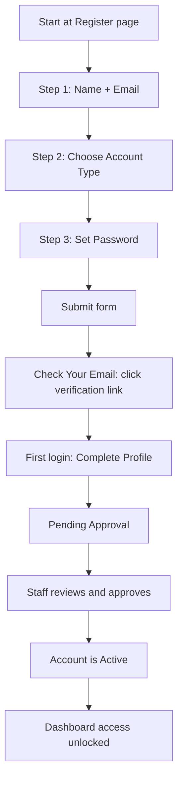

import { Aside } from '@astrojs/starlight/components';

This guide walks through the complete account creation experience from the user's perspective, showing each stage from filling out the registration form to getting full dashboard access. It is intended as a plain-language overview for end users, librarians, and support staff. For technical API details, see the Development and API sections of the documentation.

---

## Flow Summary

---

## Stage 1: Registration Form

**Where**: `/register`

The registration page is a single multi-step form with three short steps. All three steps are completed on the same page.

**Step 1 – Personal Information**
- First name and last name (automatically formatted with correct capitalization)
- Email address (a permanent address you can access; temporary or disposable email services are not accepted)

**Step 2 – Account Type**
- Choose the option that best describes your relationship with the institution (examples: Student by program year, Professor / Faculty, Guest / Visitor)
- This selection determines which fields appear later in Profile Completion, your default borrowing limits, and which dashboard layout you see

**Step 3 – Security Setup**
- Create a password and confirm it. Passwords must be 8–128 characters and include at least one uppercase letter, one lowercase letter, one number, and one special character. Common keyboard patterns and character substitutions of your name or email username are blocked.
- Complete the human verification step on-screen before submitting.

<Aside type="note" title="Privacy Note">
For your privacy, the registration page does not reveal whether an email is already registered. Whether the address is new or already exists in the system, an appropriate email is always sent containing the correct next steps.
</Aside>

---

## Stage 2: Email Verification

**Where**: `/email-confirmation`

Immediately after you submit the registration form, a verification email is sent.

**What to do next**:
1. Open the email (check your Spam or Junk folder if it does not arrive within a few minutes)
2. Click the **single-use verification link** inside the email. The link expires 24 hours after being sent.
3. Your email address is now marked verified.

If the link expired or you need a new message, use the **Resend Email** button on the Email Confirmation page. It has a short cooldown between requests to prevent abuse.

---

## Stage 3: First Login and Profile Completion

**Where**: After logging in, you are directed to `/profile-completion` automatically.

Once your email is verified, you sign in and complete a short profile form before the dashboard is unlocked. The exact fields shown depend on the account type you chose during registration:

- **Students** – student registration number, year of study, phone number, and stream/department
- **Professors / Faculty** – department or specialization, phone number
- **Guests / Visitors** – phone number, institution or organization, city/state/country, and a short statement about the purpose of your visit

You can leave and come back later — if you sign out before finishing, you are returned to Profile Completion automatically on your next login. Dashboard access is unavailable until you submit this step.

---

## Stage 4: Pending Approval

**Where**: `/pending-approval`

After profile submission, your account enters a review period. This is normal for most institutions and protects against unauthorized accounts.

While waiting:
- The page shows a friendly "under review" message and a summary of the information you submitted, for your confirmation
- Use the **Refresh Status** button anytime to check whether a decision has been made
- You can also sign out and return later

When a staff member approves the account, a success banner appears and you are redirected to your dashboard after a brief countdown. If additional information is required, you receive a notice with instructions.

---

## Stage 5: Account is Active

Once approved:
- Dashboard access is unlocked
- You can browse the catalog, place borrow requests, manage reservations, and use every feature available to your account type
- A welcome notification appears in your notification center

**Tip**: From the dashboard, we recommend new users:
1. Visit **My Profile** to add a profile picture and confirm your details
2. Open **Settings** → **Security & MFA Settings** to enable Multi-Factor Authentication for account safety
3. Review **Notification Preferences** so you receive due-date reminders and reservation-ready alerts

---

## Checking Your Account Status Anytime

If you are unsure which stage you are at:
- Sign in at `/login` — you are directed to the correct stage automatically
- Or visit `/check-status` for a public status-check flow using your email and a one-time passcode

---

## Troubleshooting the Flow

| Problem | What to do |
|---------|-----------|
| Verification email never arrives | Wait 5–10 minutes, then check the Spam or Junk folder. Use **Resend Email** on the Email Confirmation page. Confirm you entered the correct email address during registration. |
| Link says "already verified" | Normal when you clicked the link more than once. Simply sign in at `/login`. If Profile Completion is pending, it prompts you next. |
| Link says "expired or invalid" | Request a new verification email from the Resend Confirmation page and then click the new link within 24 hours. |
| Stuck on Pending Approval for longer than expected | Click **Refresh Status** on the Pending Approval page. If the delay is unusual for your institution, contact the library help desk or the administrator. |
| Cannot log in after approval | Reset your password using the **Forgot Password** link on the login page, or try signing in again with the correct email capitalization. |
| Says "wrong email or password" but you are sure | Use **Forgot Password** on the login page to set a new password. Remember passwords are case-sensitive. |

---

## Related Documentation

- [Registration Guide](/user-guides/registration-guide) — Full step-by-step instructions with detailed validation rules and troubleshooting
- [Profile Guide](/user-guides/profile-guide) — Managing your profile information after activation
- [Settings Guide](/user-guides/settings-guide) — Notification preferences, MFA setup, and personalization options

---

**Last Updated**: August 7, 2026
