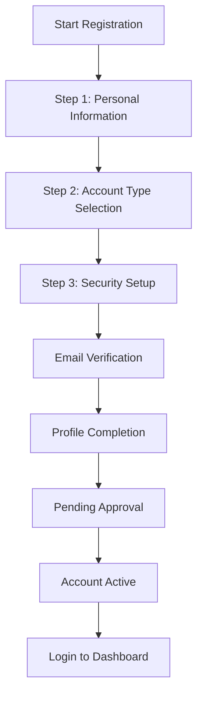

This guide walks you through the full account creation process for the SJRS Library Management System.

## Overview

Creating an account involves a short registration form, email verification, profile completion, and (for most users) a brief review by library staff before the account is fully active.



---

## Step-by-Step Registration Process

**Start here**: [https://sjrslms.in/register](https://sjrslms.in/register) — all three steps below run on this single page (Step 1, then Step 2, then Step 3).

### 📍 Step 1: Personal Information

**Required Information**:
- **Email Address**: A valid, permanent email address you can access. Used for verification and all future communication.
- **First Name**: Legal first name (automatically capitalized).
- **Last Name**: Legal last name (automatically capitalized).

#### Features
- **Auto-formatting**: Names are capitalized correctly on input and blur, including support for spaces, hyphens, and apostrophes.
- **Email format check**: Validates email structure before you proceed.
- **Resume hint**: If you started registration on this device previously and enter the same email, a banner appears with one-tap shortcuts to Email Confirmation or Resend Confirmation (only your email is remembered; other form entries are not preserved for security).
- **Progress indicator**: A visual step tracker at the top of the form shows your current position.

#### Validation Rules
- **Email**
  - Valid format only (e.g., `name@example.edu`).
  - Temporary or disposable email services are blocked. Use a permanent address you control.
  - For your security, the system does not reveal on-screen whether an email is already registered. For any valid email address, it proceeds and sends an email containing next steps appropriate to your account status.
- **Names (First & Last)**
  - Required fields. Max 50 characters each.
  - Supports spaces, hyphens, and apostrophes (e.g., `O'Neil`, `Smith-Jones`).

#### User Experience
- Fully responsive layout: desktop, tablet, and mobile work smoothly. Desktop users see a rotating inspirational panel alongside the form.
- Mobile-friendly: correctly-sized tap targets, appropriate keyboard types for each field, and standard browser auto-complete hints for email, name, and password.
- Inline validation messages appear without reloading; step indicator always shows current and upcoming steps.

---

### 🎯 Step 2: Account Type Selection

Your institution configures the account types shown to match its community of library users (students by program/year, faculty, visiting researchers, guests, etc.). Choose the option that best describes you — it determines which fields appear in Profile Completion below and sets your default borrowing limits and dashboard layout.

- Common categories: **Student** (may be further split by program or year), **Professor / Faculty**, or **Guest / Visitor**.
- Can be changed later: contact library administration if your status changes.

> Note: Exact labels on your page may differ from the examples above (e.g., "Philosophy – Year 2" instead of generic "Student"). Pick whichever option best matches your current relationship with the institution.

---

### 🔒 Step 3: Security Setup

**Required Information**:
- **Password**: Meets all rules listed below.
- **Confirm Password**: Entered a second time to catch typos.

#### Password Requirements

```
✅  8–128 characters
✅  At least one uppercase letter, one lowercase letter, one number, one special character
❌  Cannot contain first name, last name, or email username — even with substitutions (0→o, 3→e, 4→a)
❌  Cannot be a known weak or common password
❌  Cannot use sequential or repeating characters (1234, abcd, qwer, aaaa, 1111)
```

> 💡 **Tip**: Hover or tap the (?) icon next to the Password label for an in-form reference of these rules.

#### Password Tips
- **Use a passphrase**: Three or four random words combined with a number and symbol (e.g., `CorrectHorse5Battery!`) are stronger and more memorable than a short random string.
- **Add length**: A 12–16 character passphrase is significantly stronger than an 8-character password even when both satisfy the minimum rules.
- **Avoid personal info**: Don't use names, email username, birthday, phone number, student ID, or institution name.

#### Additional Security
- **CAPTCHA / Bot Protection**: A Cloudflare Turnstile challenge must be completed. If CAPTCHA is temporarily unavailable, registration cannot proceed — please try again later or contact the administrator.
- All data sent over HTTPS; registration and related actions are rate-protected against abuse.

---

## 📧 Email Verification

**Go here after submitting the form**: [https://sjrslms.in/email-confirmation](https://sjrslms.in/email-confirmation) — you're redirected here automatically, and can also navigate to it directly.

### Process

1. A confirmation email is sent immediately after you submit the form.
2. Open the email and click the single-use verification link (works on any device).
3. Your email is marked verified → next, you log in and complete your profile.

### Details

- **Expires in 24 hours**: Request a new one if needed ([see Troubleshooting](#troubleshooting)).
- **Single-use only**: Clicking a used link shows a friendly "already verified" message — just log in at [https://sjrslms.in/login](https://sjrslms.in/login).
- **Resend button**: Available on this page with a 30-second cooldown between requests.
- **No link in the URL? You're still in the right place**: If you land here without clicking the verification link from your email (e.g. you refreshed the page after registering, or bookmarked this address), the page still shows what to do next: a "Check Your Email" summary with the Next Steps, a "Wrong email?" shortcut to re-enter your email, and the Resend Email and Go to Login buttons.

---

## After Registration: Onboarding

Once your email is verified, the system guides you through two final stages before your dashboard is unlocked.

### 1. Complete Your Profile

**Location**: [https://sjrslms.in/profile-completion](https://sjrslms.in/profile-completion) — appears automatically after your first post-verification login.

The exact fields depend on your chosen account type, with a step-by-step guided form and Next / Previous navigation plus a progress indicator.

- **Students**: Registration Number (student ID), Year of Study, Phone Number
- **Faculty / Professors**: Stream / Department / Specialization, Phone Number
- **Guests / Visitors**: Phone Number, About / Institution / Purpose, City, State, Country

> If you log out before finishing, you'll be automatically returned here on your next login. Dashboard access is unavailable until this step is submitted.

### 2. Pending Admin Approval

**Location**: [https://sjrslms.in/pending-approval](https://sjrslms.in/pending-approval)

After profile submission, your account enters a **Pending Approval** state — normal and required for most institutions.

What this page shows:
- A clear "under review" message
- A summary of the key details you submitted, for confirmation
- A **Refresh Status** button to check for approval
- A **Logout** button

When approved: a success banner appears, and after a few seconds you're redirected to your dashboard. If corrections are required, you'll receive a rejection notice with instructions to resubmit.

### 3. Account Active

You can now sign in any time to browse the catalog, place holds, make reservations, check out materials (subject to your account type's limits), and use all other features available to your user type.

---

## Troubleshooting

### Registration Problems

**Email Already Registered / No Visible Error on Submit**
```
For your security, the system does not reveal whether an email is already registered.
Instead, an appropriate email is always sent:

1. Check inbox (and spam/junk folder) for that email.
2. If the email was already registered, you'll receive a "welcome back" / password-reset style message.
3. If nothing arrives, wait briefly then use the Resend Confirmation page
   (see link under Email Verification above).
4. Contact support if you believe there is an error.
```

**Password Not Accepted**
```
1. Review the password requirements in Step 3 above.
2. Reference the in-form ? icon next to the Password label.
3. Common character substitutions of your name or email username are detected.
4. Try a longer passphrase (12+ characters with mixed types).
```

**CAPTCHA / Human Verification Problem**
```
1. Complete the Turnstile challenge in Step 3 — a checkmark should appear.
2. If it expires, the challenge resets automatically; complete it again.
3. If CAPTCHA appears unavailable on screen, refresh the page.
4. If still unavailable, registration cannot proceed — try again later or contact the administrator.
```

**Temporary / Disposable Email Blocked**
```
1. Use a permanent, personal email address you control long-term.
2. School or work email addresses are preferred where applicable.
3. Contact support if you have a valid reason for an unusual domain and believe
   it was rejected in error.
```

### Email Verification Problems

**Verification Email Not Received**
```
1. Allow up to 5–10 minutes (delivery depends on your provider).
2. Check Spam / Junk / Clutter folders.
3. Use Resend Email on the Email Confirmation page (30-second cooldown).
4. If you entered the wrong email, correct it via the Resend Confirmation page
   (see the Email Verification section link above).
5. Add the library sender domain to your email contacts / safe senders list.
```

**Confirmation Link Expired ("Invalid or expired confirmation token")**
```
Request a new verification email from the Resend Confirmation page (see Email
Verification section above), then click the new link within 24 hours.
```

**Confirmation Link Already Used ("Email already confirmed")**
```
Expected — your email was already verified. Simply log in. If you haven't completed
Profile Completion yet, you'll be prompted for that next.
```

### Profile & Approval Problems

**Stuck on Profile Completion Page / Can't Access Dashboard**
```
1. Fill every required field in the form.
2. Use Next / Previous to navigate — all steps must be completed.
3. Submit the final step to advance to Pending Approval.
4. Contact support if a required field cannot be filled (e.g., you don't know
   your registration number).
```

**Status Still "Pending Approval" After Some Time**
```
1. Click Refresh Status on the Pending Approval page.
2. Allow the processing time communicated by your institution.
3. If you received a rejection email, follow its instructions and resubmit.
4. Contact the library help desk if the delay is unexpected.
```

---

## Security Best Practices

### Password Security

```
✅  Use a passphrase (3–4 unrelated words). Longer is always stronger.
      Example: "Purple!Coffee8Plays$Guitar42"
✅  Include uppercase, lowercase, number, and special character types.
✅  Use a different password for every online service.
❌  Never reuse your SJRS LMS password on any other site.
❌  Avoid names, birthdays, student IDs, institution names, or common
     keyboard patterns (qwerty, asdf, 1234).
```

- **Use a password manager** to generate, store, and auto-fill strong unique passwords.
- **Enable 2FA** from your profile settings once your account is approved.
- Library staff will **never** ask you for your password via email, chat, or phone.

### Account Security

- Choose an email provider you trust, and protect it with its own strong password and 2FA.
- Avoid registering on public Wi-Fi when possible; if you must use one, confirm HTTPS (padlock icon) and consider a trusted VPN.
- Keep your operating system and browser updated.
- Periodically review your account activity page after login. Report anything unfamiliar to the library help desk.

---

## Support

- **Email / Help Desk**: Use your institution's published support address (see the library website or the Help link inside the app after login). In-person help is also available at the library help desk during service hours.
- **Self-service**: Most common issues are resolved without contacting staff — use the Login, Resend Confirmation, and Reset Password pages linked earlier in this guide.
- **Other guides**: See the rest of the User Guides (top navigation) for borrowing, reservations, penalties, profile settings, the dashboard, and library services.

---

## FAQ

**Q: Can I change my account type after registration?**
A: Yes — contact library administration if your status changes.

**Q: What if I forget my password?**
A: Use the **"Forgot Password"** link on the Login page.

**Q: Can I register with a temporary or disposable email?**
A: No. A permanent, accessible email is required for verification, password recovery, and notifications. Known temporary email providers are blocked automatically.

**Q: Is my personal information secure?**
A: Yes. All data is encrypted in transit, stored securely, and handled per the institution's privacy policy and applicable regulations.

**Q: How long does email verification take?**
A: The email is sent instantly. Delivery varies by provider — usually under a minute, but allow up to 5–10 minutes and check spam/junk.

**Q: Can I register multiple accounts?**
A: No — each person should have one account. Duplicate accounts may be suspended. If your status changes, request an account type update.

**Q: Why do I see "Pending Approval" after finishing my profile?**
A: Most accounts require a short staff review before activation. Check back any time by clicking **Refresh Status**.

**Q: What browsers are supported?**
A: Latest Chrome, Firefox, Safari, and Edge. Keep your browser up to date.

**Q: Is JavaScript required?**
A: Yes — form validation, CAPTCHA, and step navigation all require it.

**Q: What if my confirmation link expires? / The Resend button is disabled.**
A: Request a new link from the Resend Confirmation page. The Resend button applies a 30-second cooldown between requests to prevent abuse; it re-enables automatically.

---

**Last Updated**: August 6, 2026
